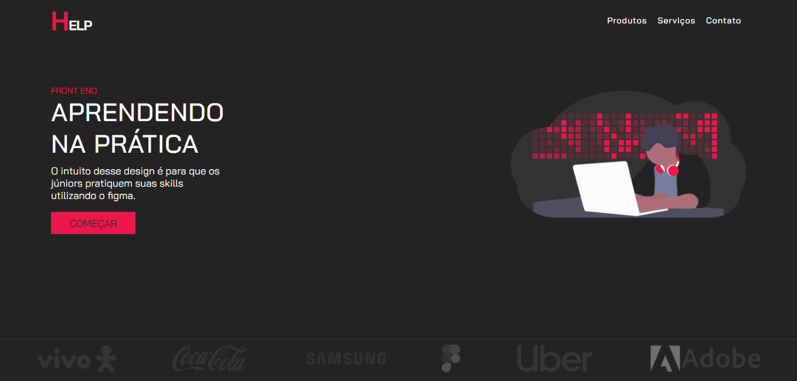

 

 

 

## O PROJETO
O layout foi disponibilizado pelo <a href="https://www.linkedin.com/in/andrei-muniz-0331ab193/">Andrei Muniz</a>, estudante de UI/UX. No formato landing page, que apresenta um site para ajudar programadores Front-end a desenvolverem a suas skills.
 
 

## TECNOLOGIAS
- 
- 
 

<strong>GitHub Pages: <a href="https://diegoreports.github.io/Help/">https://diegoreports.github.io/Help/</a></strong>

---

## LICENÇA

 
MIT

 

---
 

Desenvolvido por 

